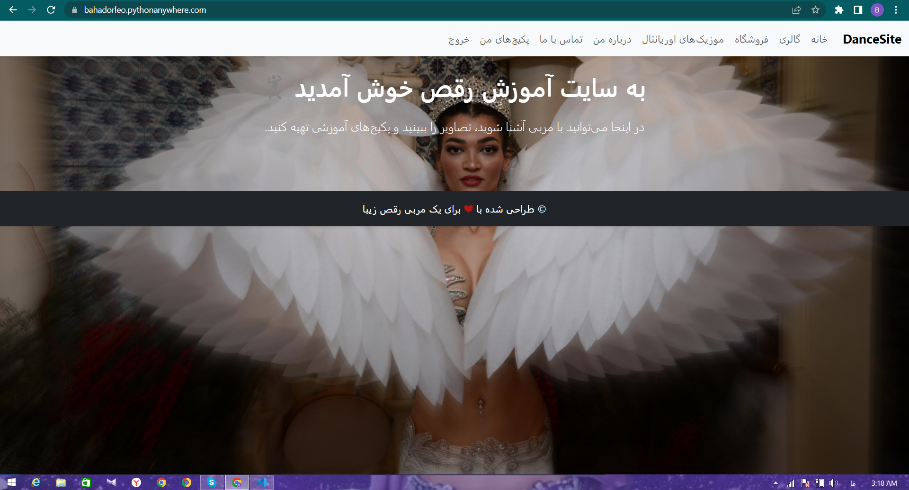
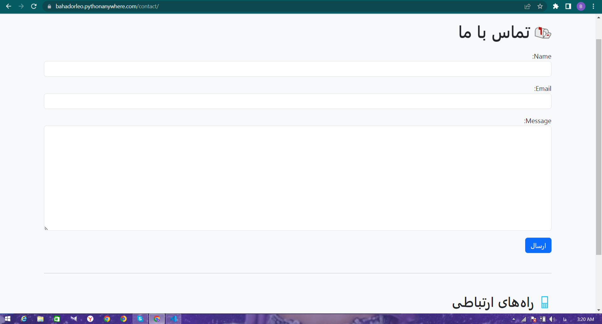
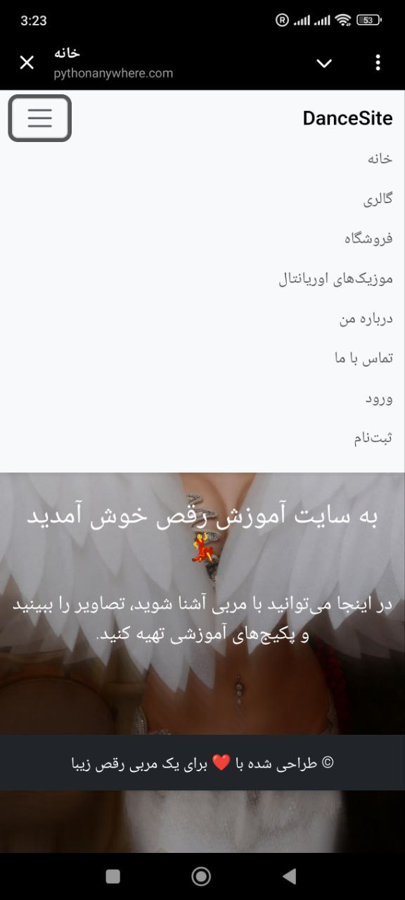
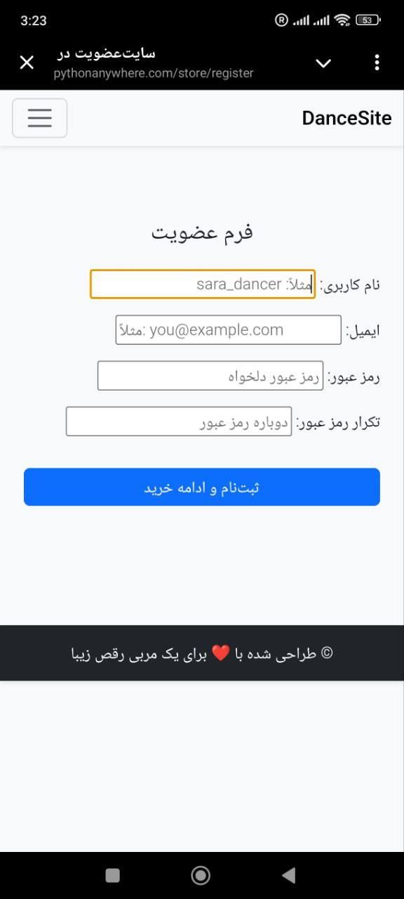

# 💃 Dance Teaching Website

A professional website for selling dance teaching packages with protected video access, user registration, gallery, and admin control – built with Django & Bootstrap.

## 🔗 Live Demo
👉 [https://bahadorleo.pythonanywhere.com](https://bahadorleo.pythonanywhere.com)

---

## 📸 Screenshots

| | | |
|--|--|--|
|  |  |  |
| !
 |  |  |

> 📂 Make sure your images are inside the `screenshots/` folder in the repo!

---

## ⚙ Features

- 🖼 Gallery with album/category support
- 💳 Video packages with secure purchase and streaming (no download)
- 🔒 Login & Register pages (authentication)
- 🧾 User dashboard: "My Packages"
- 📬 Contact form + Admin-editable social media links
- 📱 Responsive mobile-friendly UI (RTL design)

---

## 🛠 Tech Stack

- Python 3.8+
- Django 4.2
- Bootstrap 5 (RTL)
- SQLite3
- PythonAnywhere (Paid Tier)

---

## 🚀 Getting Started (Dev Mode)

```bash
git clone https://github.com/bahadorsfq/dance_site.git
cd dance_site
python -m venv venv
source venv/bin/activate
pip install -r requirements.txt
python manage.py migrate
python manage.py runserver
🩰 Dance Training Website – فارسی

A professional Persian-language website for dance education, offering a complete platform including video package sales, image galleries, oriental music collections, user registration, purchase history, and a full-featured admin panel. Fully responsive and optimized for Android mobile devices.

📁 Project Structure
csharp
Copy
Edit
dance_site/
├── core/               # Gallery, contact, about
├── store/              # Store, purchase logic, registration
├── templates/
│   ├── base.html       # Global layout
│   ├── store/          # Store templates
│   └── core/           # Gallery, contact, about
├── media/              # Uploaded videos and images
├── static/             # Static files (CSS/JS)
└── db.sqlite3
🧑‍💻 Developer
This project was built with ❤️ by Bahador Sfq
📩 Want to hire me? Feel free to reach out!